  <b>Software Engineering Undergraduate · Bahria University Karachi Campus</b> 
  SQE Executive · Former Chief Quality Officer (QA Lead) · SDET · Data Sciences · AI/ML Engineering &nbsp;|&nbsp; Open to Affiliation Work

  <i>I build tested, documented, real-world software. Off the keyboard, I recharge on two wheels. Always up for connecting with people shipping useful things.</i>

  
  &nbsp;&nbsp;
  
  &nbsp;&nbsp;
  

---

# 👨‍💻 About Me

  

---

# 🏢 Industry & Product Experience

### 🔬 **Instant Solutions Lab (ISL)** — *SQE Executive* `Apr 2026 – Jun 2026`
- Executed API, UI/UX, and functional testing across **7+ mobile and web products** (Fanatech, BandBox, Hometown, Ticketdrop, Rent-Pay Return) on Android & iOS via Android Studio and TestFlight.
- Triaged crash telemetry in **Firebase Crashlytics**, converting reproducible issues into logged defects with acceptance criteria and reproduction steps.
- Produced the comprehensive documentation suite for **CancunAI** (app + web portal) — SRS, FRS, Definition of Done, business logic, and designed user flows for a Hospital Management System (HMS).

### 🎯 **Quantaflix** — *Chief Quality Officer (QA Lead)* `Apr 2025 – Oct 2025`
- Promoted from QA Engineer to lead a **3-person QA team**, establishing standardized defect tracking workflows, test planning, and release readiness criteria.
- Led quality assurance for **T.R.A.V.E.L** (SaaS-based B2C ERP), maintaining test plans, defect reports, and release notes in Jira targeting booking-flow performance.
- Logged **50+ UI and usability defects** across iterative regression cycles using Postman and browser inspection tools.

### 🌐 **codiosync** — *SQA Executive & Founding Member* `Sep 2025 – Dec 2025`
- Performed recurring manual and API regression cycles on **themetalytics**, a SaaS-based Institute Management System (IMS) across 7 modules (student, teacher, scheduling, admin).
- Maintained QA documentation and coordinated defect tracking and backlog hygiene in step with sprint cycles.

### 💼 **Clinet** — *Co-Founder & Business Administrator* `Sep 2024 – Jan 2026`
- Delivered white-labeled standalone deployments of the core SaaS platform for clients requiring dedicated architecture with client-specific theming.
- Conducted exploratory validation and product research on **Travenet** (SaaS-based travel CRM & ERP), flagging role-based access control (RBAC) defects.

### 🛡️ **YCSOL** — *Software Quality Assurance Analyst (SQAA)* `Aug 2023 – Aug 2024`
- Validated role-based access workflows across admin, developer, and financial roles on internal CRM/ERP platforms.
- Executed regression and sanity testing cycles on **YourCloudCampus** (CCMS), including complaint management and defect lifecycle verification.

---

# 🚀 Tech Stack & Skills

<table width="100%">
  <tr>
    <td width="50%" valign="top">
      <h4>🧪 Testing &amp; Quality Engineering</h4>
      
      
      
      
      
      
      
      
    </td>
    <td width="50%" valign="top">
      <h4>🛠️ QA Tools &amp; Documentation</h4>
      
      
      
      
      
      
      
      
    </td>
  </tr>
  <tr>
    <td width="50%" valign="top">
      <h4>💻 Programming Languages</h4>
      
      
      
      
      
      
      
      
    </td>
    <td width="50%" valign="top">
      <h4>🌐 Web &amp; Backend Engineering</h4>
      
      
      
      
      
      
      
      
    </td>
  </tr>
  <tr>
    <td width="50%" valign="top">
      <h4>🗄️ Databases</h4>
      
      
      
      
    </td>
    <td width="50%" valign="top">
      <h4>⚙️ Platforms &amp; DevOps</h4>
      
      
      
      
      
      
    </td>
  </tr>
</table>

---

# 🌟 Featured Projects

<table width="100%">
  <tr>
    <td width="50%" valign="top">
      <h3>🛡️ <a href="https://github.com/SufiyanAasim/smart-network-intrusion-detection-system">Smart Network Intrusion Detection (S-NIDS)</a></h3>
      
Multi-model network intrusion detection, consensus triage, and policy-governed autonomous defense workspace. Analyzes streaming network packets and orchestrates automated defensive responses against anomalies.

      
<b>Tech:</b> <code>Python</code> • <code>Machine Learning</code> • <code>Network Security</code> • <code>Telemetry Streaming</code> • <code>Policy Automation</code>

    </td>
    <td width="50%" valign="top">
      <h3>💳 <a href="https://github.com/SufiyanAasim/digiwallsys">DigiWallSys — Digital Wallet &amp; Ledger</a></h3>
      
Full-stack digital wallet platform featuring verified funding, immutable double-entry ledger accounting, dynamic QR payments, transfer automation, fraud risk controls, spending alerts, and audited admin operations.

      
<b>Tech:</b> <code>JavaScript</code> • <code>Node.js</code> • <code>Express</code> • <code>PostgreSQL</code> • <code>Double-Entry Accounting</code> • <code>REST API</code>

    </td>
  </tr>
  <tr>
    <td width="50%" valign="top">
      <h3>⚡ <a href="https://github.com/SufiyanAasim/queueless">Queueless — Smart Queue System</a></h3>
      
Cloud-native smart token &amp; queue management system featuring real-time queues, an integrated AI assistant, internal team messaging, and ML-powered wait-time predictions.

      
<b>Tech:</b> <code>React</code> • <code>Node.js</code> • <code>Express</code> • <code>Firebase Firestore</code> • <code>Cloud Functions</code> • <code>Machine Learning</code>

    </td>
    <td width="50%" valign="top">
      <h3>📊 <a href="https://github.com/SufiyanAasim/process-monitor-manager">Process Monitor Manager</a></h3>
      
Lightweight, menu-driven terminal CLI, Zenity GUI, and live auto-refreshing TUI dashboard for monitoring and managing Ubuntu/Linux system processes using native POSIX tooling (<code>procps</code>, <code>psmisc</code>, <code>curses</code>).

      
<b>Tech:</b> <code>Bash / Shell</code> • <code>Linux (procps, curses)</code> • <code>Zenity GUI</code> • <code>POSIX Utilities</code> • <code>System Monitoring</code>

    </td>
  </tr>
</table>

---

# 📈 GitHub Stats & Activity

  
  &nbsp;&nbsp;
  

  

---

# 📜 Education & Certifications

### 🎓 Education
* **Bachelor of Science in Software Engineering (BSE)** — *Bahria University Karachi Campus* `Expected 2027`
  * Focus: AI/ML Engineering
  * Coursework: Software Quality Engineering, Data Sciences, Data Mining, Data Structures & Algorithms, OOP
* **Intermediate in Pre-Engineering** — *Bahria College N.O.R.E. I* `Completed 2022`
  * Extracurricular: Bahria Model United Nations (BMUN)

### 🏅 Certifications
* **Full-Stack Web Development** — *Aptech* `2024`
* **Digital Marketing & SEO** — *Aptech* `2024`

---

