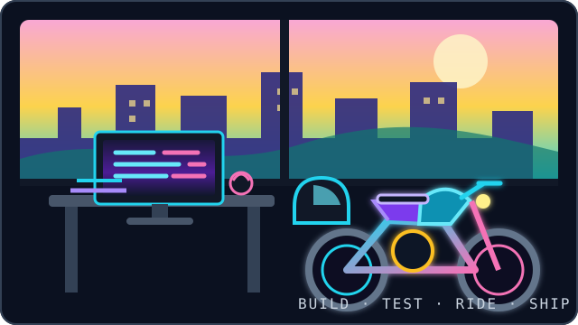
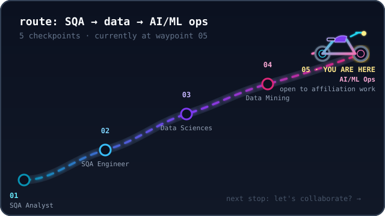

  <b>Software Engineering Undergraduate · Karachi, Pakistan</b> 
  SQA Analyst · SQA Engineer · Data Sciences · Data Mining · AI/ML Ops &nbsp;|&nbsp; Open to Affiliation Work

  <i>I build tested, documented, real-world software. Off the keyboard, I recharge on two wheels. Always up for connecting with people shipping useful things.</i>

  
  &nbsp;&nbsp;
  
  &nbsp;&nbsp;
  

  <a href="#behind-the-keyboard">Behind the Keyboard</a> ·
  <a href="#route-map">Route Map</a> ·
  <a href="#tech-stack">Tech Stack</a> ·
  <a href="#shipped">What I've Shipped</a> ·
  <a href="#activity">GitHub Activity</a> ·
  <a href="#pit-stop">Pit Stop</a> ·
  <a href="#reach-out">Reach Out</a>

---

## `> behind the keyboard.`

  
  

---

## `> route map.`

  

---

## `> under the hood.`

  

---

## `> what i've shipped.`

  
  
   
  
  <!-- FUTURE_PROJECT: Add the fourth repository card beside Process Monitor Manager when it is ready. -->

---

## `> github activity.`

  
  

  

<i>currently: building, testing, learning — and enjoying the road between releases.</i>

  <picture>
    <source media="(prefers-color-scheme: dark)" srcset="https://raw.githubusercontent.com/SufiyanAasim/SufiyanAasim/output/github-contribution-grid-snake-dark.svg" />
    <source media="(prefers-color-scheme: light)" srcset="https://raw.githubusercontent.com/SufiyanAasim/SufiyanAasim/output/github-contribution-grid-snake.svg" />
    
  </picture>

---

## `> pit stop.`

<code>&gt; cat pit-stop.log</code> — a few things off the resume

 

- 🏍️ Genuinely happier debugging with a helmet within reach — motorcycle rides double as rubber-duck sessions.
- 🧪 I default to writing the test before the fix; it's saved me more than once.
- 📍 Based in Karachi, Pakistan — open to remote affiliation work, not tied to a fixed internship track.
- ☕ Currently deep in Data Sciences, Data Mining, and AI/ML Ops — expect that to show up in upcoming repos.
- 🗣️ Fluent in English and Urdu, and always up for a call to talk shop.

---

## `> reach out.`

If you liked what you saw, let's connect.

  
  &nbsp;&nbsp;
  

---

## `> license.`

  <a href="LICENSE">MIT License</a> © 2026 Mohammad Sufiyan Aasim — the SVG artwork, the snake workflow, and this README's layout are free to fork and remix.

---

⭐ <b>Found a section, an SVG, or the snake workflow worth stealing? Fork it and make it yours.</b>

