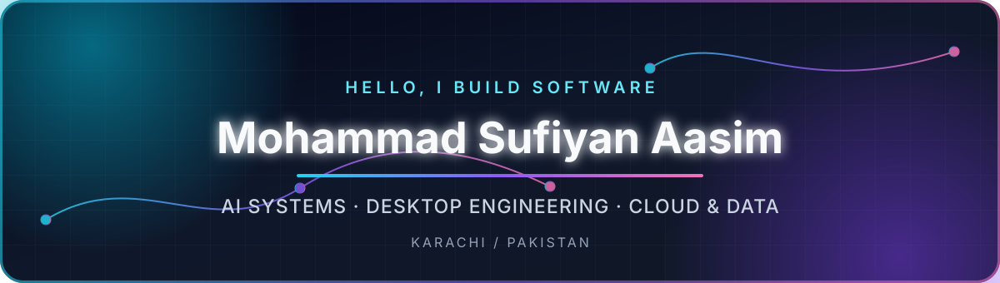

<div align="center">



<br/>

<a href="https://git.io/typing-svg">
  
</a>

<p>
  <a href="https://github.com/SufiyanAasim?tab=followers"></a>
  <a href="https://github.com/SufiyanAasim?tab=repositories"></a>
  
</p>

**Software Engineer at ISL · Karachi, Pakistan**<br/>
I build secure, well-documented software across **AI/ML, desktop systems, cloud platforms, networking, and quality engineering**.

</div>

---

## `> engineering with purpose`

I enjoy taking projects beyond prototypes: modular architecture, persistent data, automated checks, clear documentation, and deployable releases. My work ranges from AI-powered desktop applications and graph algorithms to real-time web platforms and Linux tooling.

```python
sufiyan = {
    "focus": ["Software Engineering", "AI/ML", "MLOps", "Data Science", "SQE"],
    "building": ["Intelligent desktop apps", "Cloud-native platforms", "Developer tools"],
    "principles": ["Offline-first", "Secure by design", "Tested", "Documented", "Shippable"],
    "location": "Karachi, Pakistan",
}
```

## `> technology stack`

<div align="center">
  
</div>

<br/>

<div align="center">

| Engineering | AI & Data | Platforms | Quality |
|:---:|:---:|:---:|:---:|
| Python · Java · C# · JavaScript | ML workflows · Search · Predictions | Desktop · Web · LAN · Cloud | Testing · CI/CD · Documentation |

</div>

## `> featured builds`

<div align="center">
  <a href="https://github.com/SufiyanAasim/queueless"></a>
  <a href="https://github.com/SufiyanAasim/smart-study-planner"></a>
  <a href="https://github.com/SufiyanAasim/smart-chess"></a>
  <a href="https://github.com/SufiyanAasim/smart-snake"></a>
  <a href="https://github.com/SufiyanAasim/metro-navigation-system"></a>
  <a href="https://github.com/SufiyanAasim/process-monitor-manager"></a>
</div>

### What these projects demonstrate

- **Queueless** — real-time queue operations, an AI assistant, team messaging, and ML-based predictions with React, Express, and Firebase.
- **Smart Study Planner** — a secure offline productivity workspace with local AI assistance, study analytics, and LAN rooms.
- **Smart Chess** — Stockfish-powered analysis, LAN multiplayer, tactical training, SQLite persistence, and PGN workflows.
- **Smart Snake** — A*, BFS, and Q-learning agents inside a Java 21 desktop game with a neon telemetry dashboard.
- **Metro Navigation System** — Dijkstra-based route planning and visualization for the Karachi Metro using C# WinForms.
- **Process Monitor Manager** — CLI, GUI, and live TUI process management built with native Linux tooling.

## `> github telemetry`

<div align="center">
  
  
  <br/>
  
</div>

> Statistics summarize public repositories and are only one part of the engineering story. Explore the projects above for architecture, documentation, and release details.

## `> currently`

- Improving production-minded AI and data engineering workflows.
- Building portfolio projects with clear architecture, automated validation, and releases.
- Exploring reliable MLOps, local-first AI, distributed systems, and software quality engineering.
- Open to meaningful collaborations and software engineering opportunities.

## `> connect`

<div align="center">

If you are building something useful, ambitious, or technically interesting, let's connect.

<br/>

<a href="https://www.linkedin.com/in/msufiyanpk"></a>
<a href="https://orcid.org/0009-0003-3279-6453"></a>
<a href="https://github.com/SufiyanAasim"></a>

<br/><br/>

<sub>Build deliberately · Test thoroughly · Document clearly · Ship confidently</sub>


</div>
